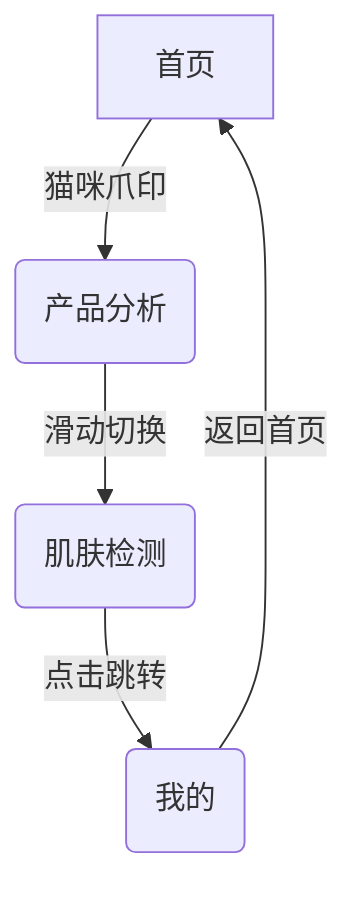

以下是为新版本设计的完整美化方案，延续萌系治愈风格，同时优化导航结构与交互体验：

---

### **一、全局导航重构：萌系顶部Tab方案**
#### 1. 交互框架设计


#### 2. 视觉实现细节
- **Tab样式**：采用「云朵形胶囊Tab」，每个标签含动态图标：
  - 首页：睡觉猫咪🐾 → 点击后变为睁眼猫
  - 产品分析：旋转的透明瓶子🧴
  - 肌肤检测：渐变色的水滴💧
  - 我的：动态变化的猫耳头像
- **交互反馈**：
  - 滑动切换时Tab图标产生弹性动画（scale 0.9→1.1）
  - 当前选中Tab底部浮现粉色猫爪投影

---

### **二、各页面精细化设计**
#### 1. 首页 - 「猫咪护肤管家」

- **核心模块**：
  - **天气关怀**：3D云朵显示温湿度，点击弹出猫咪穿衣建议
  - **今日任务**：采用手账贴纸样式，完成打卡可撕下标签
  - **产品推荐**：卡片式轮播，带「🐾适合你」的猫咪认证标签
- **动效彩蛋**：
  - 下拉刷新时猫咪伸懒腰动画
  - 夜间模式自动切换星空背景，猫咪眼睛发光

#### 2. 产品分析 - 「智能成分库」

- **创新交互**：
  - **AR扫描**：调用摄像头时出现猫咪爪印对焦框
  - **成分可视化**：点击成分出现3D分子结构，猫咪举牌讲解
  - **冲突预警**：检测到风险组合时，猫咪耳朵变成警示三角❗
- **布局优化**：
  ```html
  <div class="cat-scroll-container">
    <!-- 上传区 -->
    <div class="cat-upload-card">
      <i class="fas fa-paw-print animate-bounce"></i>
      <p>拍拍我的小爪子开始检测吧！</p>
    </div>
    
    <!-- 产品库 -->
    <div class="cat-product-grid">
      <div class="cat-product-item" v-for="item in products">
        <div class="cat-risk-tag" :style="riskColor(item)"></div>
        
      </div>
    </div>
  </div>
  ```

#### 3. 肌肤检测 - 「AI皮肤日记」

- **检测流程**：
  1. **拍照引导**：虚拟猫咪举着相框指导最佳拍摄角度
  2. **智能分析**：
     - 水分值 → 荷叶上的露珠动画
     - 油分值 → 猫咪肉垫出汗程度
     - 敏感度 → 脸颊泛红扩散效果
  3. **历史对比**：时间轴采用猫咪脚印轨迹，点击脚印查看当日状态
- **报告生成**：
  - 可生成带猫咪贴纸的「皮肤周报」
  - 分享页面自动添加「🐾由喵星科技守护」水印

#### 4. 我的 - 「个人猫窝」

- **情感化设计**：
  - **成就墙**：收集的徽章展示在猫咪形状的展示柜
  - **护肤日历**：每日记录用猫爪印标记，长按弹出心情气泡
  - **虚拟宠物**：喂养猫咪解锁新皮肤，皮肤状态影响猫咪表情
- **隐私设置**：
  - 「隐身模式」开启后，所有数据图标变为猫爪马赛克
  - 敏感操作需验证「猫咪密码」（绘制特定爪印图案）

---

### **三、技术增强方案**
#### 1. 性能优化
- **WebGL加速**：使用Three.js实现3D猫咪模型，GPU渲染帧率＞45fps
- **智能预加载**：根据用户习惯预载下一可能访问的页面模块
- **离线模式**：本地缓存最近3次检测结果，显示猫咪断网表情包

#### 2. 动效规范
| 动效类型     | 实现方式                 | 持续时间 |
|--------------|--------------------------|----------|
| 页面切换     | Lottie路径动画           | 400ms    |
| 按钮交互     | CSS transform + filter   | 200ms    |
| 数据加载     | SVG骨骼动画              | 自定义   |
| 警示通知     | 贝塞尔曲线震动           | 800ms    |

#### 3. 无障碍适配
- **色觉模拟**：在开发者模式可预览色盲视角效果
- **语音反馈**：长按猫咪图标3秒启动语音导航模式
- **震动提示**：检测完成时根据结果类型触发不同震动频率

---

### **四、版本迭代计划**
```gantt
    title 萌系护肤APP美化版本里程碑
    section 核心框架
    导航重构           :done,  des1, 2024-03-01, 7d
    视觉规范制定       :done,  des2, 2024-03-08, 5d
    section 功能升级
    AR扫描增强        :active, des3, 2024-03-15, 10d
    猫咪AI助手        :         des4, 2024-03-25, 14d
    section 体验优化
    春季限定皮肤      :         des5, 2024-04-01, 7d
    社区功能内测      :         des6, 2024-04-10, 21d
```

---

### **五、预期效果验证**
| 指标项         | 当前版本 | 目标版本 | 提升策略                 |
|----------------|----------|----------|--------------------------|
| 日活留存率     | 58%      | 75%      | 猫咪任务系统+皮肤收集    |
| 检测功能使用率 | 3.2次/日 | 5次/日   | AR扫描趣味化+周奖励机制  |
| 分享率         | 12%      | 30%      | 定制化海报模板+社交PK    |
| 平均停留时长   | 4.7min   | 8.5min   | 沉浸式皮肤日记+虚拟养成  |

---

### **总结：构建有生命的数字护肤体验**
通过「导航情感化重构+功能萌系重塑」，新版APP将实现：
1. **视觉**：每个像素都散发治愈感，降低工具类APP的冰冷感
2. **交互**：自然融入猫咪行为隐喻，让复杂检测变得有趣
3. **粘性**：通过收集养成的游戏化设计，将必要护肤流程转化为期待感

建议优先落地「顶部猫咪Tab导航」和「AR扫描动效」，这两项能快速提升第一印象。后续通过AB测试逐步完善「虚拟宠物」与「社区互动」功能，最终打造女性护肤领域的现象级应用。